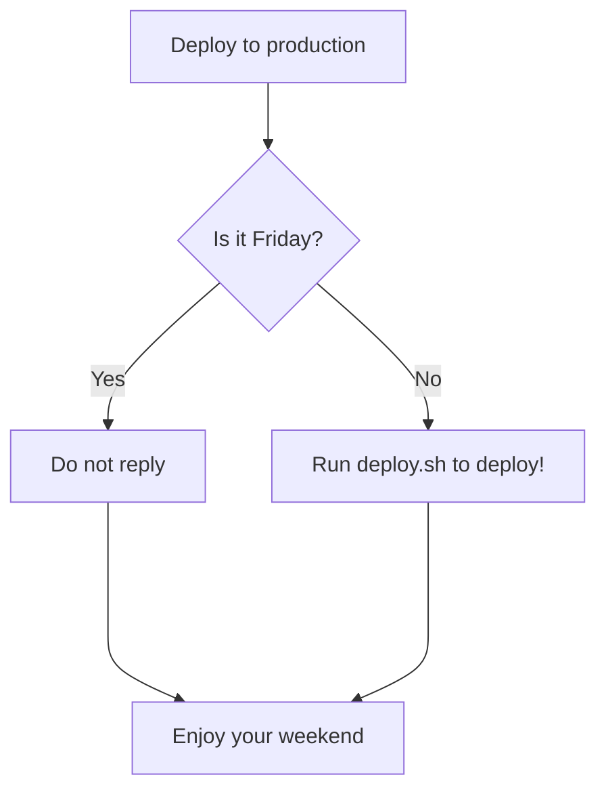

## Table of contents

- [Objective](#objective)
- [Assumptions](#assumptions)
- [Workflow](#workflow)
- [Requirements](#requirements)
- [Users](#users)
- [Data](#data)
- [Scope](#scope)
- [Creators](#creators)
- [Contacts](#contacts)
- [Glossary](#glossary)

## Applications

[](https://support.safe.com/hc/en-us)

## Objective

- provide timely advice to swimmers not to enter the water and swim in Titahi Bay
- understand how to forecast sewer overflows using rainfall average recurrence interval (ARI) estimates

## Assumptions

order | assumption | notes
--- | --- | ---
'1' | The BFP database will need to use a property ID as its primary key to capture both property inspections and BFP devices at a property. This is because a survey may not result in a BFP device needing to be installed/replaced, or there may be multiple BFP devices on a property | **Requirements 1-7 - make it clear in the requirements**

## Workflow



## Requirements

order | requirement | user story | business rules
--- | --- | --- | ---
'1' | The solution must be accessible on desktop machine and mobile device | I should be able to log in to the application via my mobile or desk top So that i can perform my tasks irrespective of the platform am using | |

## Users

activity | summary of activities
--- | ---
Reporting and Integration | Functionalities that support data sharing with the client councils

## Data

### Table 1

General use table:

- one
- two

field | data type | compulsory (y/n) | notes
--- | --- | --- | ---
full namne | string(64) | y | basic information

## Scope

id | what | why | so?
--- | --- | --- | ---

## API Reference

#### Get all items

```http
  GET /api/items
```

| Parameter | Type     | Description                |
| :-------- | :------- | :------------------------- |
| `api_key` | `string` | **Required**. Your API key |

#### Get item

```http
  GET /api/items/${id}
```

| Parameter | Type     | Description                       |
| :-------- | :------- | :-------------------------------- |
| `id`      | `string` | **Required**. Id of item to fetch |

#### add(num1, num2)

Takes two numbers and returns the sum.

## Creators

**Creator 1**

- <https://github.com/usernamecreator1>

## Contacts

council | contact | email | contact details
--- | --- | --- | ---
UHCC | Kelly Gee | Kelly.Gee@uhcc.govt.nz | Building Compliance Officer

## Glossary

term | meaning
--- | ---
ARI | Average Recurrence Interval usually in years