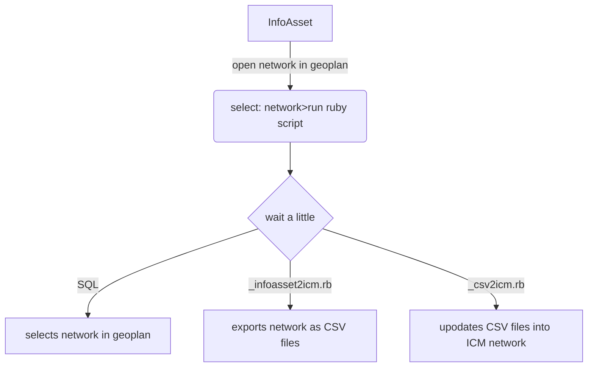

## Table of contents

- [Purpose](#purpose)
- [Assumptions](#assumptions)
- [Workflow](#workflow)
- [Requirements](#requirements)
- [Users](#users)
- [Data](#data)
- [Scope](#scope)
- [Creators](#creators)
- [Contacts](#contacts)
- [Glossary](#glossary)

## Applications

[](https://www.autodesk.com/nz)

## Purpose

This repository contains script and supporting files to assist in the conversion of an InfoAsset network to 
Infoworks ICM (InfoWorks network).

Currently the main Ruby script file "_infoasset2icm.rb" can be run on the active network ie the one open in the Geoplan.

On completion of the code a new network will be updated into:
- database: snumbat://10.0.29.43:40000/wastewater ongoing/system_performance
- network: name='i2i network', location='other..networks' and id=4765

## Assumptions

order | assumption | notes
--- | --- | ---
'1' | access to ICM Ultimate and ICM Exchange.exe | **version used: ICM 2024.5**
'2' | access to ICM Ultimate and iexchange.exe | **version used: InfoAsset 2021.8.1**
'3' | understanding on InfoAsset SQL | **good**
'4' | understanding on ICM | **good**
'5' | understading on Ruby Script | **good**

## Workflow



## Requirements

order | requirement | user story | business rules
--- | --- | --- | ---
'1' | The solution must be accessible on desktop machine and mobile device | I should be able to log in to the application via my mobile or desk top So that i can perform my tasks irrespective of the platform am using | |

## Users

activity | summary of activities
--- | ---
Reporting and Integration | Functionalities that support data sharing with the client councils

## Data

### Table 1

General use table:

- one
- two

field | data type | compulsory (y/n) | notes
--- | --- | --- | ---
full namne | string(64) | y | basic information

## Scope

id | what | why | so?
--- | --- | --- | ---

## API Reference

#### Get all items

```http
  GET /api/items
```

| Parameter | Type     | Description                |
| :-------- | :------- | :------------------------- |
| `api_key` | `string` | **Required**. Your API key |

#### Get item

```http
  GET /api/items/${id}
```

| Parameter | Type     | Description                       |
| :-------- | :------- | :-------------------------------- |
| `id`      | `string` | **Required**. Id of item to fetch |

#### add(num1, num2)

Takes two numbers and returns the sum.

## Creators

**Creator 1**

- <https://github.com/usernamecreator1>
- <https://www.linkedin.com/pulse/converting-infosewer-model-icm-infoworks-network-using-dickinson/>
- <https://help.autodesk.com/lessons/IWICMS_2024_ENU/files/Exchange.pdf>

## Contacts

council | contact | email | contact details
--- | --- | --- | ---
UHCC | Kelly Gee | Kelly.Gee@uhcc.govt.nz | Building Compliance Officer

## Glossary

term | meaning
--- | ---
ARI | Average Recurrence Interval usually in years