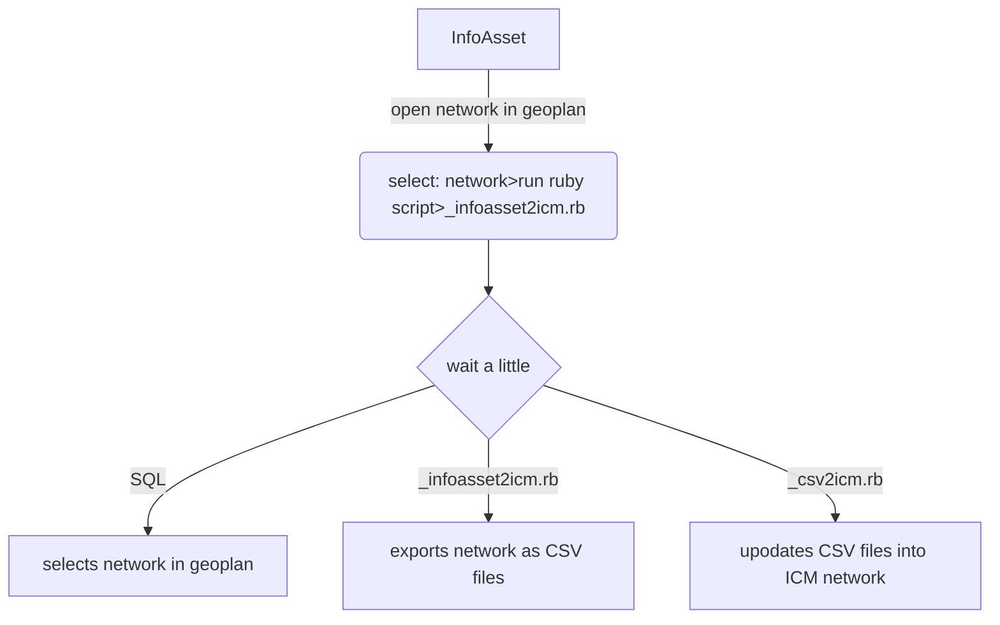

## Table of contents 

- [Purpose](#purpose)
- [Requirements](#requirements)
- [Workflow](#workflow)
- [Code](#code)
- [Recommendations](#recommendations)
- [Web](#web)
- [Contacts](#contacts)

## Applications

[](https://www.autodesk.com/nz)

## Purpose

This repository contains script and supporting files to assist in the conversion of an InfoAsset network to 
Infoworks ICM (InfoWorks network).

The purpose of this piece of work is to:

- remove the disconnect between the hydraulic models and asset data stored in InfoAsset
- enable a more robust model maintenance strategy for hydraulic model builds
- the intention from this point onwards is to maintain InfoAsset with the best available information such as pipe material, inverts and ground levels
- following some tidy up the base data it will then be possible to push changes such as new data/changed data and remove assets that have been deleted in InfoAsset

## Requirements

order | assumption | notes
--- | --- | ---
'1' | access to ICM Ultimate and ICM Exchange.exe | **version used: ICM 2024.5**
'2' | access to ICM Ultimate and iexchange.exe | **version used: InfoAsset 2021.8.1**
'3' | understanding on InfoAsset SQL | **good**
'4' | understanding on ICM | **good**
'5' | understading on Ruby Script | **good**

## Workflow

Currently the main Ruby script file "_infoasset2icm.rb" can be run on the active network ie the one open in the Geoplan.

On completion of the code a new network will be updated into:
- database: snumbat://10.0.29.43:40000/wastewater ongoing/system_performance
- network name='i2i network'
- network location='>other>networks>'
- network id=4765



## Code

#### Run Ruby script in network currently open in an InfoAsset Geoplan

- The is ruby script is to be run on the active network
- The first part of the script runs an SQL on the network
- This SQL effectively selects the network thats important for the hydraulic models
- The remainder of the SQL then pushes the selected network as CSV files to a folder

##### source GIS
<p align="left">
  
</p>

```sql
/*  object type: all nodes and links
    purpose: select the network thats important 
    for the wastewater hydraulic model
*/

DESELECT ALL;

list $status = 'INUS', 'REPU', 'STBY', 'STOK', 'END', 'VIRT';
list $type = 'ACBH', 'ACCL', 'ACDP', 'BNDY', 'HHLD', 'END';
list $pipe_type = 'DSCH_2', 'MAIN', 'TRNK';

SELECT ALL FROM [All Nodes] IN Base SCENARIO WHERE MEMBER(status,$status)=TRUE AND MEMBER(node_type,$type)=FALSE;
SELECT ALL FROM [All Links] IN Base SCENARIO WHERE MEMBER(status,$status)=TRUE AND MEMBER(pipe_type,$pipe_type)=TRUE;
SELECT ALL FROM [Pump] IN Base SCENARIO WHERE MEMBER(status,$status)=TRUE;
SELECT ALL FROM [Screen] IN Base SCENARIO WHERE MEMBER(status,$status)=TRUE;
SELECT ALL FROM [Orifice] IN Base SCENARIO WHERE MEMBER(status,$status)=TRUE;
SELECT ALL FROM [Sluice] IN Base SCENARIO WHERE MEMBER(status,$status)=TRUE;
SELECT ALL FROM [Flume] IN Base SCENARIO WHERE MEMBER(status,$status)=TRUE;
SELECT ALL FROM [Siphon] IN Base SCENARIO WHERE MEMBER(status,$status)=TRUE;
SELECT ALL FROM [Weir] IN Base SCENARIO WHERE MEMBER(status,$status)=TRUE;
SELECT ALL FROM [Valve] IN Base SCENARIO WHERE MEMBER(status,$status)=TRUE;
```

```ruby
# infoasset2icm.rb

# EXPORT MODEL NETWORK AS CSV AND TSV FILES

# ===========================================================================================
# parameters
folder = 'C:\Users\HLewis\Downloads\infoasset2icm_wastewater_model'

net=WSApplication.current_network
net.clear_selection

net.run_SQL('Node', "
	list $status = 'INUS', 'REPU', 'STBY', 'STOK', 'END', 'VIRT';
	list $type = 'ACBH', 'ACCL', 'ACDP', 'BNDY', 'HHLD', 'END';
	list $pipe_type = 'DSCH_2', 'MAIN', 'TRNK';

	SELECT ALL FROM [All Nodes] IN Base SCENARIO WHERE MEMBER(status,$status)=TRUE AND MEMBER(node_type,$type)=FALSE;
	SELECT ALL FROM [All Links] IN Base SCENARIO WHERE MEMBER(status,$status)=TRUE AND MEMBER(pipe_type,$pipe_type)=TRUE;
	SELECT ALL FROM [Pump] IN Base SCENARIO WHERE MEMBER(status,$status)=TRUE;
	SELECT ALL FROM [Screen] IN Base SCENARIO WHERE MEMBER(status,$status)=TRUE;
	SELECT ALL FROM [Orifice] IN Base SCENARIO WHERE MEMBER(status,$status)=TRUE;
	SELECT ALL FROM [Sluice] IN Base SCENARIO WHERE MEMBER(status,$status)=TRUE;
	SELECT ALL FROM [Flume] IN Base SCENARIO WHERE MEMBER(status,$status)=TRUE;
	SELECT ALL FROM [Siphon] IN Base SCENARIO WHERE MEMBER(status,$status)=TRUE;
	SELECT ALL FROM [Weir] IN Base SCENARIO WHERE MEMBER(status,$status)=TRUE;
	SELECT ALL FROM [Valve] IN Base SCENARIO WHERE MEMBER(status,$status)=TRUE;
	")

# Set up params
csv_options=Hash.new
csv_options['Use Display Precision'] = false
csv_options['Flag Fields '] = false
csv_options['Multiple Files'] = true
csv_options['Selection Only'] = true
csv_options['Coordinate Arrays Format'] = 'Packed'
csv_options['Other Arrays Format'] = 'Separate'
csv_options['WGS84'] = false
tsv_options = Hash.new
tsv_options['Export Selection'] = true

# Export CSV files
net.csv_export(folder + '\exports\csv\network.csv', csv_options)

# Export TSV files
## look through these .. later on
net.odec_export_ex('TSV', folder + '\infoasset2icm.cfg', tsv_options, 'Pump', folder + '\exports\tsv\pump.txt')
net.odec_export_ex('TSV', folder + '\infoasset2icm.cfg', tsv_options, 'Screen', folder + '\exports\tsv\screen.txt')
net.odec_export_ex('TSV', folder + '\infoasset2icm.cfg', tsv_options, 'Orifice', folder + '\exports\tsv\orifice.txt')
net.odec_export_ex('TSV', folder + '\infoasset2icm.cfg', tsv_options, 'Sluice', folder + '\exports\tsv\sluice.txt')
net.odec_export_ex('TSV', folder + '\infoasset2icm.cfg', tsv_options, 'Flume', folder + '\exports\tsv\flume.txt')
net.odec_export_ex('TSV', folder + '\infoasset2icm.cfg', tsv_options, 'Siphon', folder + '\exports\tsv\siphon.txt')
net.odec_export_ex('TSV', folder + '\infoasset2icm.cfg', tsv_options, 'Weir', folder + '\exports\tsv\weir.txt')
net.odec_export_ex('TSV', folder + '\infoasset2icm.cfg', tsv_options, 'Valve', folder + '\exports\tsv\valve.txt')

net.clear_selection

# Run the second batch file
#system(folder + '\_network.bat')
```

#### Run a batch file

- The last few lines of the above ruby script starts a batch file
- The batch file bascially starts and application ... ICMExchange.exe
- and passes the following ruby script for it to process

```bat
@echo off

set version=2024
if %version%==2024 (set "folder=Autodesk\InfoWorks ICM Ultimate 2024\ICMExchange.exe")

set bit=64
if %bit%==32 (set "path=C:\Program Files (x86)")
if %bit%==64 (set "path=C:\Program Files")

"%path%\%folder%" "%~dp0%\_network.rb"

PAUSE
```

#### Run a second Ruby script

- The final script picks up the InfoAsset exported network CSV files
- In conjunction with the InfoAsset fields it applies various lookup tables to create new fields
- the final set of data is then pushed to a network in an ICM model
- The push of data will append new rows, overwrite existing rows with changed data and delete and ones removed from InfoAsset

##### endpoint for  GIS
<p align="left">
  
</p>

The following table was used as a template for each import class

| order | in_feature | Text | Description | out_feature | out_type | ruby_code | notes |
| --- | --- | --- | --- | --- | --- | --- | --- |
| 1 | valve.type | SRM1 | Sewer-Rising Main Valve AIR | orifice.link_type | Orific | 'SRM1' => 'Orific',    #Sewer-Rising Main Valve AIR | create an orifice - however make sure it is full open |
| 2 | valve.type | SRM2 | Sewer-Rising Main Valve BF | orifice.link_type | Orific | 'SRM2' => 'Orific',    #Sewer-Rising Main Valve BF | create an orifice - however make sure it is full open |
| 3 | valve.type | SRM3 | Sewer-Rising Main Valve Gate | orifice.link_type | Orific | 'SRM3' => 'Orific',    #Sewer-Rising Main Valve Gate | create an orifice - however make sure it is full open |
| 4 | valve.type | SRM4 | Sewer-Rising Main Valve NR | orifice.link_type | Orific | 'SRM4' => 'Orific',    #Sewer-Rising Main Valve NR | create an orifice - however make sure it is full open |
| 5 | valve.type | SRM5 | Sewer-Rising Main Valve Reflux | flap.valve_type | Circular | 'SRM5' => 'Circular',    #Sewer-Rising Main Valve Reflux |  |
| 6 | valve.type | SRM6 | Sewer-Rising Main Valve Sluice | sluice.link_type | Sluice | 'SRM6' => 'Sluice',    #Sewer-Rising Main Valve Sluice |  |
| 7 | valve.type | SRM7 | Sewer-Rising Main Shut Valve | orifice.link_type | Orific | 'SRM7' => 'Orific',    #Sewer-Rising Main Shut Valve | create an orifice - however make sure it is full closed |
| 8 | screen.type | S | Standard | NA | NA | 'S' => 'NA',    #Standard | out_type not needed as there isn't a type in ICM |
| 9 | sluice.type | S | Standard | sluice.link_type | Sluice | 'S' => 'Sluice',    #Standard |  |
| 10 | sluice.type | V | Variable vertical sluice | sluice.link_type | VSGate | 'V' => 'VSGate',    #Variable vertical sluice |  |
| 83 | sluice.type | RS | Radial sluice | sluice.link_type | RSGate | 'RS' => 'RSGate',    #Radial sluice | this would be a new type in InfoAsset |
| 84 | sluice.type | VR | Variable radial sluice | sluice.link_type | VRGate | 'VR' => 'VRGate',    #Variable radial sluice | this would be a new type in InfoAsset |
| 11 | all.system_type | PWDB | Potable Water Distribution | all.system_type | water | 'PWDB' => 'water',    #Potable Water Distribution |  |
| 12 | all.system_type | PWSC | Potable Water Service Connection | all.system_type | water | 'PWSC' => 'water',    #Potable Water Service Connection |  |
| 13 | all.system_type | PWST | Potable Water Storage | all.system_type | water | 'PWST' => 'water',    #Potable Water Storage |  |
| 14 | all.system_type | PWTM | Potable Water Transmission | all.system_type | water | 'PWTM' => 'water',    #Potable Water Transmission |  |
| 15 | all.system_type | PWTP | Potable Water Treatment  | all.system_type | water | 'PWTP' => 'water',    #Potable Water Treatment  |  |
| 16 | all.system_type | RWST | Raw Water Storage | all.system_type | water | 'RWST' => 'water',    #Raw Water Storage |  |
| 17 | all.system_type | RWTN | Raw Water Transfer | all.system_type | water | 'RWTN' => 'water',    #Raw Water Transfer |  |
| 18 | all.system_type | SWCO | Stormwater Collection | all.system_type | storm | 'SWCO' => 'storm',    #Stormwater Collection |  |
| 19 | all.system_type | SWSC | Stormwater Service Connection | all.system_type | storm | 'SWSC' => 'storm',    #Stormwater Service Connection |  |
| 20 | all.system_type | SWTD | Stormwater Treatment Device | all.system_type | storm | 'SWTD' => 'storm',    #Stormwater Treatment Device |  |
| 21 | all.system_type | WWCO | Wastewater Collection  | all.system_type | foul | 'WWCO' => 'foul',    #Wastewater Collection  |  |
| 22 | all.system_type | WWSC | Wasterwater Service Connection | all.system_type | foul | 'WWSC' => 'foul',    #Wasterwater Service Connection |  |
| 23 | all.system_type | WWST | Wastewater Storage | all.system_type | foul | 'WWST' => 'foul',    #Wastewater Storage |  |
| 24 | all.system_type | WWTP | Wastewater Treatment  | all.system_type | foul | 'WWTP' => 'foul',    #Wastewater Treatment  |  |
| 25 | node.node_type | ACBH | Bore Hole  (Well / Wellhead ) | node.node_type | storage | 'ACBH' => 'storage',    #Bore Hole  (Well / Wellhead ) |  |
| 26 | node.node_type | ACCL | Chlorination Point | node.node_type | break | 'ACCL' => 'break',    #Chlorination Point |  |
| 27 | node.node_type | ACDP | Cable Draw Point | node.node_type | break | 'ACDP' => 'break',    #Cable Draw Point |  |
| 28 | node.node_type | ACDW | Dry Well  | node.node_type | storage | 'ACDW' => 'storage',    #Dry Well  |  |
| 29 | node.node_type | ACFM | Flowmeter Chamber | node.node_type | manhole | 'ACFM' => 'manhole',    #Flowmeter Chamber |  |
| 30 | node.node_type | ACMH | Access Chamber Manhole | node.node_type | manhole | 'ACMH' => 'manhole',    #Access Chamber Manhole |  |
| 31 | node.node_type | ACPU | Pump Chamber | node.node_type | storage | 'ACPU' => 'storage',    #Pump Chamber |  |
| 32 | node.node_type | ACSY | Syphon Chamber  | node.node_type | break | 'ACSY' => 'break',    #Syphon Chamber  |  |
| 33 | node.node_type | ACVP | Vent Point | node.node_type | break | 'ACVP' => 'break',    #Vent Point |  |
| 34 | node.node_type | ACVU | Vacuum Chamber / Pit | node.node_type | manhole | 'ACVU' => 'manhole',    #Vacuum Chamber / Pit |  |
| 35 | node.node_type | ACVX | Vortex Chamber | node.node_type | manhole | 'ACVX' => 'manhole',    #Vortex Chamber |  |
| 36 | node.node_type | ACWW | Wet Well  | node.node_type | storage | 'ACWW' => 'storage',    #Wet Well  |  |
| 37 | node.node_type | BEND | Bend | node.node_type | break | 'BEND' => 'break',    #Bend |  |
| 38 | node.node_type | END | End | node.node_type | manhole | 'END' => 'manhole',    #End |  |
| 39 | node.node_type | HHLD | Household | node.node_type | break | 'HHLD' => 'break',    #Household |  |
| 40 | node.node_type | INGD | Inlet Grated Open End | node.node_type | gully | 'INGD' => 'gully',    #Inlet Grated Open End |  |
| 41 | node.node_type | INND | Inlet Open End | node.node_type | gully | 'INND' => 'gully',    #Inlet Open End |  |
| 42 | node.node_type | JOIN | Join | node.node_type | break | 'JOIN' => 'break',    #Join |  |
| 43 | node.node_type | LHCE | Lamphole Cleaning Eye | node.node_type | break | 'LHCE' => 'break',    #Lamphole Cleaning Eye |  |
| 44 | node.node_type | METR | Meter | node.node_type | break | 'METR' => 'break',    #Meter |  |
| 45 | node.node_type | OTGD | Outlet Grated Open End | node.node_type | gully | 'OTGD' => 'gully',    #Outlet Grated Open End |  |
| 46 | node.node_type | OTND | Outlet Open End | node.node_type | gully | 'OTND' => 'gully',    #Outlet Open End |  |
| 47 | node.node_type | PSTN | Pump Station | node.node_type | storage | 'PSTN' => 'storage',    #Pump Station |  |
| 48 | node.node_type | RGDN | Rain Garden | node.node_type | storage | 'RGDN' => 'storage',    #Rain Garden |  |
| 49 | node.node_type | SMP1 | Sump Single Side Entry | node.node_type | gully | 'SMP1' => 'gully',    #Sump Single Side Entry |  |
| 50 | node.node_type | SMP2 | Sump Double Side Entry | node.node_type | gully | 'SMP2' => 'gully',    #Sump Double Side Entry |  |
| 51 | node.node_type | SMPD | Sump Dome | node.node_type | gully | 'SMPD' => 'gully',    #Sump Dome |  |
| 52 | node.node_type | TEE | Tee | node.node_type | break | 'TEE' => 'break',    #Tee |  |
| 53 | node.node_type | VALV | Valve | node.node_type | break | 'VALV' => 'break',    #Valve |  |
| 54 | all.status | INUS | In Use | NA | NA | 'INUS' => 'NA',    #In Use | used to filter active assets - otherwise not used in ICM |
| 55 | all.status | AOOS | Active - Out of Service  | NA | NA | 'AOOS' => 'NA',    #Active - Out of Service  | used to filter active assets - otherwise not used in ICM |
| 56 | all.status | STBY | Active - Standby  | NA | NA | 'STBY' => 'NA',    #Active - Standby  | used to filter active assets - otherwise not used in ICM |
| 57 | all.status | STOK | Active - Stock | NA | NA | 'STOK' => 'NA',    #Active - Stock | used to filter active assets - otherwise not used in ICM |
| 58 | all.status | REMO | Removed | NA | NA | 'REMO' => 'NA',    #Removed | used to filter active assets - otherwise not used in ICM |
| 59 | all.status | ABAN | Abandoned | NA | NA | 'ABAN' => 'NA',    #Abandoned | used to filter active assets - otherwise not used in ICM |
| 60 | all.status | SPAR | Decommissioned / Spare | NA | NA | 'SPAR' => 'NA',    #Decommissioned / Spare | used to filter active assets - otherwise not used in ICM |
| 61 | all.status | VIRT | Virtual connection | NA | NA | 'VIRT' => 'NA',    #Virtual connection | used to filter active assets - otherwise not used in ICM |
| 62 | all.status | REPU | Active - Repurposed (Duct) | NA | NA | 'REPU' => 'NA',    #Active - Repurposed (Duct) | used to filter active assets - otherwise not used in ICM |
| 63 | all.status | EROR | Error during Data Entry | NA | NA | 'EROR' => 'NA',    #Error during Data Entry | used to filter active assets - otherwise not used in ICM |
| 64 | flume.type | R | Rectangular-throated Flume | flume.link_type | RFLUME | 'R' => 'RFLUME',    #Rectangular-throated Flume |  |
| 65 | flume.type | T | Trapezoidal-throated Flume | flume.link_type | TFLUME | 'T' => 'TFLUME',    #Trapezoidal-throated Flume |  |
| 66 | flume.type | U | U-throated Flume | flume.link_type | UFLUME | 'U' => 'UFLUME',    #U-throated Flume |  |
| 67 | flume.type | F | Regular Flume | flume.link_type | RFLUME | 'F' => 'RFLUME',    #Regular Flume |  |
| 68 | orifice.type | O | Orifice | orifice.link_type | Orific | 'O' => 'Orific',    #Orifice |  |
| 69 | orifice.type | V | Variable discharge | orifice.link_type | Vldorf | 'V' => 'Vldorf',    #Variable discharge |  |
| 70 | pump.type | F | Fixed Speed Pump | pump.link_type | FIXPMP | 'F' => 'FIXPMP',    #Fixed Speed Pump |  |
| 71 | pump.type | V | Variable Speed Pump | pump.link_type | VSPPMP | 'V' => 'VSPPMP',    #Variable Speed Pump |  |
| 72 | pump.type | R | Rotodynamic Pump | pump.link_type | ROTPMP | 'R' => 'ROTPMP',    #Rotodynamic Pump |  |
| 73 | pump.type | S | Screw pump | pump.link_type | SCRPMP | 'S' => 'SCRPMP',    #Screw pump |  |
| 74 | siphon.type | G | General | NA | NA | 'G' => 'NA',    #General | out_type not needed as there isn't a type in ICM |
| 75 | weir.type | S | Standard | weir.link_type | Weir | 'S' => 'Weir',    #Standard |  |
| 76 | weir.type | VC | Variable Crest | weir.link_type | VCWEIR | 'VC' => 'VCWEIR',    #Variable Crest |  |
| 77 | weir.type | VW | Variable Weir | weir.link_type | VWWEIR | 'VW' => 'VWWEIR',    #Variable Weir |  |
| 78 | weir.type | CO | Contracted Rectangular | weir.link_type | COWEIR | 'CO' => 'COWEIR',    #Contracted Rectangular |  |
| 79 | weir.type | VN | Vee Notch | weir.link_type | VNWEIR | 'VN' => 'VNWEIR',    #Vee Notch |  |
| 80 | weir.type | TR | Trapezoidal Notch | weir.link_type | TRWEIR | 'TR' => 'TRWEIR',    #Trapezoidal Notch |  |
| 81 | weir.type | BR | Broad Crested | weir.link_type | BRWEIR | 'BR' => 'BRWEIR',    #Broad Crested |  |
| 82 | weir.type | GW | Gated weir | weir.link_type | GTWEIR | 'GW' => 'GTWEIR',    #Gated weir | this would be a new type in InfoAsset |

```ruby
# IMPORT NETWORK DATA FROM CSV FILES INTO AN ICM NETWORK

## Import the 'date' library
require 'date'
WSApplication.use_arcgis_desktop_licence

## parameters
folder='C:/Users/HLewis/Downloads/infoasset2icm_wastewater_model/'
db=WSApplication.open('//10.0.29.43:40000/wastewater ongoing/system_performance',false)
nw = db.model_object_from_type_and_id('Model Network',4765)

## reserve network so no-one else can use it
nw.reserve

## Define a useful class
class ImportTable
	attr_accessor :tbl_format, :in_table, :cfg_file, :csv_file, :cb_class

	def initialize(tbl_format, in_table, cfg_file, csv_file, cb_class)
		@tbl_format = tbl_format
		@in_table = in_table
		@cfg_file = cfg_file
		@csv_file = csv_file
		@cb_class = cb_class
	end
end

## Attribute Conversion from InfoAsset CSV Files into InfoWorks ICM

# Callback Classes
# Node - from InfoAsset manhole

class ImporterClassNode
	def ImporterClassNode.onBeginNode(obj)
	
		@systemTypeLookup={
			'PWDB' => 'water',    	#Potable Water Distribution
			'PWSC' => 'water',    	#Potable Water Service Connection
			'PWST' => 'water',    	#Potable Water Storage
			'PWTM' => 'water',    	#Potable Water Transmission
			'PWTP' => 'water',    	#Potable Water Treatment 
			'RWST' => 'water',    	#Raw Water Storage
			'RWTN' => 'water',    	#Raw Water Transfer
			'SWCO' => 'storm',    	#Stormwater Collection
			'SWSC' => 'storm',    	#Stormwater Service Connection
			'SWTD' => 'storm',    	#Stormwater Treatment Device
			'WWCO' => 'foul',    	#Wastewater Collection 
			'WWSC' => 'foul',    	#Wasterwater Service Connection
			'WWST' => 'foul',    	#Wastewater Storage
			'WWTP' => 'foul'     	#Wastewater Treatment 
		}
	
		@nodeTypeLookup = {		
			'ACBH' => 'manhole',    #Bore Hole  (Well / Wellhead )
			'ACCL' => 'break',    	#Chlorination Point
			'ACDP' => 'break',    	#Cable Draw Point
			'ACDW' => 'manhole',    #Dry Well 
			'ACFM' => 'manhole',    #Flowmeter Chamber
			'ACMH' => 'manhole',    #Access Chamber Manhole
			'ACPU' => 'manhole',    #Pump Chamber
			'ACSY' => 'break',    	#Syphon Chamber 
			'ACVP' => 'break',    	#Vent Point
			'ACVU' => 'manhole',    #Vacuum Chamber / Pit
			'ACVX' => 'manhole',    #Vortex Chamber
			'ACWW' => 'manhole',    #Wet Well 
			'BEND' => 'break',    	#Bend
			'END' => 'manhole',    	#End
			'HHLD' => 'break',    	#Household
			'INGD' => 'gully',    	#Inlet Grated Open End
			'INND' => 'gully',    	#Inlet Open End
			'JOIN' => 'manhole',    #Join
			'LHCE' => 'break',    	#Lamphole Cleaning Eye
			'METR' => 'break',    	#Meter
			'OTGD' => 'gully',    	#Outlet Grated Open End
			'OTND' => 'gully',    	#Outlet Open End
			'PSTN' => 'manhole',    #Pump Station
			'RGDN' => 'manhole',    #Rain Garden
			'SMP1' => 'gully',    	#Sump Single Side Entry
			'SMP2' => 'gully',    	#Sump Double Side Entry
			'SMPD' => 'gully',    	#Sump Dome
			'TEE' => 'break',     	#Tee
			'VALV' => 'break'     	#Valve
		}
	end
	
	def ImporterClassNode.onEndRecordNode(obj)
		
		inNodeType = obj['node_type']
		inSystemType = obj['system_type']
		
		if !inNodeType.nil?
			inNodeType = inNodeType#.downcase
		end
		
		if !inSystemType.nil?
			inSystemType = inSystemType#.downcase
		end
				
		if @nodeTypeLookup.has_key? inNodeType
			icmNodeNodeType = @nodeTypeLookup[inNodeType]
		else
			icmNodeNodeType = 'manhole'
		end
		
		if @systemTypeLookup.has_key? inSystemType
			icmNodeSystemType = @systemTypeLookup[inSystemType]
		else
			icmNodeSystemType = 'other'
		end
		
		obj['node_type'] = icmNodeNodeType
		obj['system_type'] = icmNodeSystemType
		
	end
end

# Pipe - from InfoAsset Pipe
#
class ImporterClassPipe
	def ImporterClassPipe.onEndRecordConduit(obj)

		@systemTypeLookup={
			'PWDB' => 'water',    	#Potable Water Distribution
			'PWSC' => 'water',    	#Potable Water Service Connection
			'PWST' => 'water',    	#Potable Water Storage
			'PWTM' => 'water',    	#Potable Water Transmission
			'PWTP' => 'water',    	#Potable Water Treatment 
			'RWST' => 'water',    	#Raw Water Storage
			'RWTN' => 'water',    	#Raw Water Transfer
			'SWCO' => 'storm',    	#Stormwater Collection
			'SWSC' => 'storm',    	#Stormwater Service Connection
			'SWTD' => 'storm',    	#Stormwater Treatment Device
			'WWCO' => 'foul',    	#Wastewater Collection 
			'WWSC' => 'foul',    	#Wasterwater Service Connection
			'WWST' => 'foul',    	#Wastewater Storage
			'WWTP' => 'foul'     	#Wastewater Treatment 
		}

		inSystemType = obj['system_type']
		
		if !inSystemType.nil?
			inSystemType = inSystemType#.upcase
		end
		
		if @systemTypeLookup.has_key? inSystemType
			icmPipeSystemType = @systemTypeLookup[inSystemType]
		else
			icmPipeSystemType = 'other'
		end
		
		obj['system_type'] = icmPipeSystemType
		
	end
end

# Pump - from InfoAsset Pump
#
class ImporterClassPump
	def ImporterClassPump.OnEndRecordPump(obj)
		
		@systemTypeLookup={
			'PWDB' => 'water',    	#Potable Water Distribution
			'PWSC' => 'water',    	#Potable Water Service Connection
			'PWST' => 'water',    	#Potable Water Storage
			'PWTM' => 'water',    	#Potable Water Transmission
			'PWTP' => 'water',    	#Potable Water Treatment 
			'RWST' => 'water',    	#Raw Water Storage
			'RWTN' => 'water',    	#Raw Water Transfer
			'SWCO' => 'storm',    	#Stormwater Collection
			'SWSC' => 'storm',    	#Stormwater Service Connection
			'SWTD' => 'storm',    	#Stormwater Treatment Device
			'WWCO' => 'foul',    	#Wastewater Collection 
			'WWSC' => 'foul',    	#Wasterwater Service Connection
			'WWST' => 'foul',    	#Wastewater Storage
			'WWTP' => 'foul'     	#Wastewater Treatment 
		}
		
		obj['link_suffix'] = obj['id'][-1]
		
		inSystemType=obj['system_type']
		
		if !inSystemType.nil?
			inSystemType = inSystemType#.downcase
		end
		
		if @systemTypeLookup.has_key? inSystemType
			icmPipeSystemType = @systemTypeLookup[inSystemType]
		else
			icmPipeSystemType = 'other'
		end
		
		obj['system_type'] = icmPipeSystemType
		
		if obj['type'].upcase == 'F' 
			obj['link_type'] == 'FIXPMP'
		elsif obj['type'].upcase == 'V' 
			obj['link_type'] == 'VSPPMP'
		elsif obj['type'].upcase == 'V' 
			obj['link_type'] = 'VFDPMP'
		elsif obj['type'].upcase == 'R' 
			obj['link_type'] = 'ROTPMP'
		elsif obj['type'].upcase == 'S' 
			obj['link_type'] = 'SCRPMP'
		end
		
	end
end

# Screen - from InfoAsset Screen
#
class ImporterClassScreen
	def ImporterClassScreen.OnEndRecordScreen(obj)
		
		@systemTypeLookup={
			'PWDB' => 'water',    	#Potable Water Distribution
			'PWSC' => 'water',    	#Potable Water Service Connection
			'PWST' => 'water',    	#Potable Water Storage
			'PWTM' => 'water',    	#Potable Water Transmission
			'PWTP' => 'water',    	#Potable Water Treatment 
			'RWST' => 'water',    	#Raw Water Storage
			'RWTN' => 'water',    	#Raw Water Transfer
			'SWCO' => 'storm',    	#Stormwater Collection
			'SWSC' => 'storm',    	#Stormwater Service Connection
			'SWTD' => 'storm',    	#Stormwater Treatment Device
			'WWCO' => 'foul',    	#Wastewater Collection 
			'WWSC' => 'foul',    	#Wasterwater Service Connection
			'WWST' => 'foul',    	#Wastewater Storage
			'WWTP' => 'foul'     	#Wastewater Treatment 
		}
		
		obj['link_suffix'] = obj['id'][-1]
		
		inSystemType=obj['system_type']
		
		if !inSystemType.nil?
			inSystemType = inSystemType#.downcase
		end
		
		if @systemTypeLookup.has_key? inSystemType
			icmPipeSystemType = @systemTypeLookup[inSystemType]
		else
			icmPipeSystemType = 'other'
		end
		
		obj['system_type'] = icmPipeSystemType
		
	end
end

# Orifice - from InfoAsset Orifice
#
class ImporterClassOrifice
	def ImporterClassOrifice.OnEndRecordOrifice(obj)
		
		@systemTypeLookup={
			'PWDB' => 'water',    	#Potable Water Distribution
			'PWSC' => 'water',    	#Potable Water Service Connection
			'PWST' => 'water',    	#Potable Water Storage
			'PWTM' => 'water',    	#Potable Water Transmission
			'PWTP' => 'water',    	#Potable Water Treatment 
			'RWST' => 'water',    	#Raw Water Storage
			'RWTN' => 'water',    	#Raw Water Transfer
			'SWCO' => 'storm',    	#Stormwater Collection
			'SWSC' => 'storm',    	#Stormwater Service Connection
			'SWTD' => 'storm',    	#Stormwater Treatment Device
			'WWCO' => 'foul',    	#Wastewater Collection 
			'WWSC' => 'foul',    	#Wasterwater Service Connection
			'WWST' => 'foul',    	#Wastewater Storage
			'WWTP' => 'foul'     	#Wastewater Treatment 
		}
		
		obj['link_suffix'] = obj['id'][-1]
		
		inSystemType=obj['system_type']
		
		if !inSystemType.nil?
			inSystemType = inSystemType#.downcase
		end
		
		if @systemTypeLookup.has_key? inSystemType
			icmPipeSystemType = @systemTypeLookup[inSystemType]
		else
			icmPipeSystemType = 'other'
		end
		
		obj['system_type'] = icmPipeSystemType
		
	end
end

# Sluice - from InfoAsset Sluice
#
class ImporterClassSluice
	def ImporterClassSluice.OnEndRecordSluice(obj)
		
		@systemTypeLookup={
			'PWDB' => 'water',    	#Potable Water Distribution
			'PWSC' => 'water',    	#Potable Water Service Connection
			'PWST' => 'water',    	#Potable Water Storage
			'PWTM' => 'water',    	#Potable Water Transmission
			'PWTP' => 'water',    	#Potable Water Treatment 
			'RWST' => 'water',    	#Raw Water Storage
			'RWTN' => 'water',    	#Raw Water Transfer
			'SWCO' => 'storm',    	#Stormwater Collection
			'SWSC' => 'storm',    	#Stormwater Service Connection
			'SWTD' => 'storm',    	#Stormwater Treatment Device
			'WWCO' => 'foul',    	#Wastewater Collection 
			'WWSC' => 'foul',    	#Wasterwater Service Connection
			'WWST' => 'foul',    	#Wastewater Storage
			'WWTP' => 'foul'     	#Wastewater Treatment 
		}
		
		obj['link_suffix'] = obj['id'][-1]
		
		inSystemType=obj['system_type']
		
		if !inSystemType.nil?
			inSystemType = inSystemType#.downcase
		end
		
		if @systemTypeLookup.has_key? inSystemType
			icmPipeSystemType = @systemTypeLookup[inSystemType]
		else
			icmPipeSystemType = 'other'
		end
		
		obj['system_type'] = icmPipeSystemType
		
	end
end

# Flume - from InfoAsset Flume
#
class ImporterClassFlume
	def ImporterClassFlume.OnEndRecordFlume(obj)
		
		@systemTypeLookup={
			'PWDB' => 'water',    	#Potable Water Distribution
			'PWSC' => 'water',    	#Potable Water Service Connection
			'PWST' => 'water',    	#Potable Water Storage
			'PWTM' => 'water',    	#Potable Water Transmission
			'PWTP' => 'water',    	#Potable Water Treatment 
			'RWST' => 'water',    	#Raw Water Storage
			'RWTN' => 'water',    	#Raw Water Transfer
			'SWCO' => 'storm',    	#Stormwater Collection
			'SWSC' => 'storm',    	#Stormwater Service Connection
			'SWTD' => 'storm',    	#Stormwater Treatment Device
			'WWCO' => 'foul',    	#Wastewater Collection 
			'WWSC' => 'foul',    	#Wasterwater Service Connection
			'WWST' => 'foul',    	#Wastewater Storage
			'WWTP' => 'foul'     	#Wastewater Treatment 
		}
		
		obj['link_suffix'] = obj['id'][-1]
		
		inSystemType=obj['system_type']
		
		if !inSystemType.nil?
			inSystemType = inSystemType#.downcase
		end
		
		if @systemTypeLookup.has_key? inSystemType
			icmPipeSystemType = @systemTypeLookup[inSystemType]
		else
			icmPipeSystemType = 'other'
		end
		
		obj['system_type'] = icmPipeSystemType
		
	end
end

# Siphon - from InfoAsset Siphon
#
class ImporterClassSiphon
	def ImporterClassSiphon.OnEndRecordSiphon(obj)
		
		@systemTypeLookup={
			'PWDB' => 'water',    	#Potable Water Distribution
			'PWSC' => 'water',    	#Potable Water Service Connection
			'PWST' => 'water',    	#Potable Water Storage
			'PWTM' => 'water',    	#Potable Water Transmission
			'PWTP' => 'water',    	#Potable Water Treatment 
			'RWST' => 'water',    	#Raw Water Storage
			'RWTN' => 'water',    	#Raw Water Transfer
			'SWCO' => 'storm',    	#Stormwater Collection
			'SWSC' => 'storm',    	#Stormwater Service Connection
			'SWTD' => 'storm',    	#Stormwater Treatment Device
			'WWCO' => 'foul',    	#Wastewater Collection 
			'WWSC' => 'foul',    	#Wasterwater Service Connection
			'WWST' => 'foul',    	#Wastewater Storage
			'WWTP' => 'foul'     	#Wastewater Treatment 
		}
		
		obj['link_suffix'] = obj['id'][-1]
		
		inSystemType=obj['system_type']
		
		if !inSystemType.nil?
			inSystemType = inSystemType#.downcase
		end
		
		if @systemTypeLookup.has_key? inSystemType
			icmPipeSystemType = @systemTypeLookup[inSystemType]
		else
			icmPipeSystemType = 'other'
		end
		
		obj['system_type'] = icmPipeSystemType
		
	end
end

# Weir - from InfoAsset Weir
#
class ImporterClassWeir
	def ImporterClassWeir.OnEndRecordWeir(obj)
		
		@systemTypeLookup={
			'PWDB' => 'water',    	#Potable Water Distribution
			'PWSC' => 'water',    	#Potable Water Service Connection
			'PWST' => 'water',    	#Potable Water Storage
			'PWTM' => 'water',    	#Potable Water Transmission
			'PWTP' => 'water',    	#Potable Water Treatment 
			'RWST' => 'water',    	#Raw Water Storage
			'RWTN' => 'water',    	#Raw Water Transfer
			'SWCO' => 'storm',    	#Stormwater Collection
			'SWSC' => 'storm',    	#Stormwater Service Connection
			'SWTD' => 'storm',    	#Stormwater Treatment Device
			'WWCO' => 'foul',    	#Wastewater Collection 
			'WWSC' => 'foul',    	#Wasterwater Service Connection
			'WWST' => 'foul',    	#Wastewater Storage
			'WWTP' => 'foul'     	#Wastewater Treatment 
		}
		
		obj['link_suffix'] = obj['id'][-1]
		
		inSystemType=obj['system_type']
		
		if !inSystemType.nil?
			inSystemType = inSystemType#.downcase
		end
		
		if @systemTypeLookup.has_key? inSystemType
			icmPipeSystemType = @systemTypeLookup[inSystemType]
		else
			icmPipeSystemType = 'other'
		end
		
		obj['system_type'] = icmPipeSystemType
		
	end
end

## Set up the config files and table names
import_tables = Array.new

import_tables.push ImportTable.new(
	'csv', 'Node', 
	folder + '/_network.cfg', 
	folder + '/exports/csv/network.csv_cams_manhole.csv',
	ImporterClassNode)
	
import_tables.push ImportTable.new(
	'csv', 'Conduit', 
	folder + '/_network.cfg', 
	folder + '/exports/csv/network.csv_cams_pipe.csv',
	ImporterClassPipe)
	
import_tables.push ImportTable.new(
	'tsv', 'Pump', 
	folder + '/_network.cfg', 
	folder + '/exports/tsv/pump.txt',
	ImporterClassPump)

import_tables.push ImportTable.new(
	'tsv', 'Screen', 
	folder + '/_network.cfg', 
	folder + '/exports/tsv/screen.txt',
	ImporterClassScreen)

import_tables.push ImportTable.new(
	'tsv', 'Orifice', 
	folder + '/_network.cfg', 
	folder + '/exports/tsv/orifice.txt',
	ImporterClassOrifice)

import_tables.push ImportTable.new(
	'tsv', 'Sluice', 
	folder + '/_network.cfg', 
	folder + '/exports/tsv/sluice.txt',
	ImporterClassSluice)

import_tables.push ImportTable.new(
	'tsv', 'Flume', 
	folder + '/_network.cfg', 
	folder + '/exports/tsv/flume.txt',
	ImporterClassFlume)

import_tables.push ImportTable.new(
	'tsv', 'Siphon', 
	folder + '/_network.cfg', 
	folder + '/exports/tsv/siphon.txt',
	ImporterClassSiphon)

import_tables.push ImportTable.new(
	'tsv', 'Weir', 
	folder + '/_network.cfg', 
	folder + '/exports/tsv/weir.txt',
	ImporterClassWeir)
	
#import_tables.push ImportTable.new(
#	'tsv', 'User control', 
#	folder + '/_network.cfg', 
#	folder + '/exports/tsv/valve.txt',
#	'')

puts 'Import tables and config file setup'

puts 'Start import'

##set options
options=Hash.new
#options['Error File'] = 'C:\Temp\ImportErrorLog.txt'		## String | blank | Path of error file
#options['Set Value Flag'] = '#A'							## String | blank | Flag used for fields set from data
options['Default Value Flag'] = '#A'						## String | blank | Flag used for fields set from the default value column
#options['Image Folder'] = 'C:\Temp\'						## String | blank | Folder to import images from (Asset networks only)
options['Duplication Behaviour'] = 'Overwrite'				## String | Merge | One of Duplication Behaviour:'Overwrite','Merge','Ignore'
#options['Units Behaviour'] = 'Native'						## String | Native | One of 'Native','User','Custom'
#options['Update Based On Asset ID'] = false				## Boolean | false
#options['Update Only'] = false								## Boolean | false
options['Delete Missing Objects'] = true					## Boolean | false
#options['Allow Multiple Asset IDs'] = false				## Boolean | false
options['Update Links From Points'] = false					## Boolean | false
#options['Blob Merge'] = true								## Boolean | false
#options['Use Network Naming Conventions'] = false			## Boolean | false
#options['Import images'] = false							## Boolean | false | Asset networks only
#options['Group Type'] = false								## Boolean | false | Asset networks only
#options['Group Name'] = false								## Boolean | false | Asset networks only
puts 'specific import options defined'
	
## import tables into ICM
# Loop over table configs
import_tables.each{|table_info|
	
	options['Callback Class'] = table_info.cb_class
	
	# Do the import
	nw.odic_import_ex(
		table_info.tbl_format,	# input table format
		table_info.cfg_file,	# field mapping config file
		options,				# specified options override the default options
		table_info.in_table,	# import to ICM table name
		table_info.csv_file		# import from MapDrain table name
	)
}

puts 'End import'

## Commit changes and unreserve the network
nw.commit('Data imported from CSV and TSV files')
nw.unreserve
puts 'Committed'
```

## Recommendations

The above work has tested how data can be imported successfully from InfoAsset into ICM.

As part of the process the following recommendations should be applied to asset data updates in InfoAsset:

1. unique ID for the following assets needs to be made up of us_node_id and a sequential number: flume, orifice, pump, screen, siphon, sluice, valve and weir 
2. link type for the above assets needs to be added to the 'standards and choice' list in InfoAsset. Its possible to adopt the same types used in the hydraulic modelling packages
3. ground levels in the original data should be saved as GPS_survey points. This way you'll have a record of the original levels before any corrections are made based on the latest ground models and or engineering judgement
4. invert levels should be converted to pipe depths... reason being the data would have been collected as depths at each manhole
5. where cover level and pipe depth data is available it is then possible to set the pipe invert flag to #D ... in doing so InfoAsset will work out the correct invert level
6. in the first instance asset data for ancillaries should be populated from the hydraulic models

## Web

- [my github front page](https://github.com/hrlewis1974)
- [How do I import an InfoWorks ICM Model into InfoAsset Manager?](https://github.com/innovyze/Open-Source-Support/tree/main/02%20InfoAsset%20Manager/01%20Ruby/0003%20Import%20an%20InfoWorks%20ICM%20Model%20into%20InfoAsset%20Manager)
- [InfoAsset and ICM Exchange language](https://help.autodesk.com/lessons/IWICMS_2024_ENU/files/Exchange.pdf)

## Contacts

council | contact | email | contact details
--- | --- | --- | ---
WWL | Hywel Lewis | hywel.lewis@wellingtonwater.co.nz | Snr Hydraulic Modeller